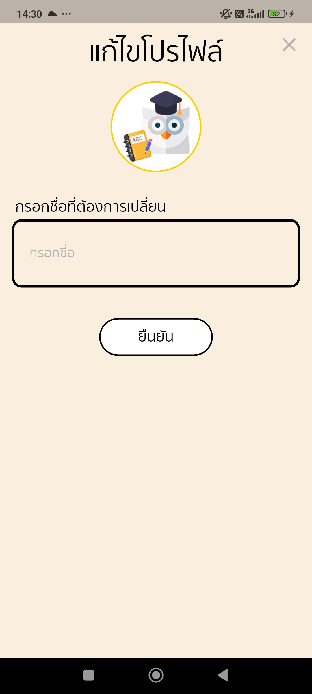
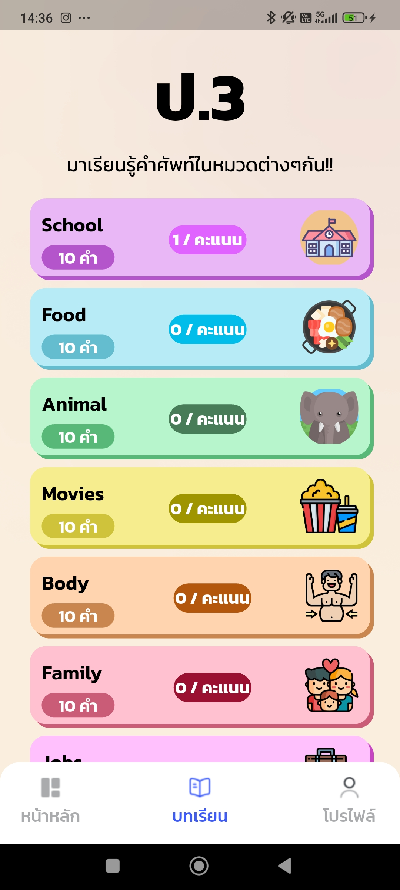

# Engkle
Application lerning for kids, Using Tex to speech and Specch to text

# 🎓 Engkle - แอปพลิเคชันเรียนภาษาอังกฤษสำหรับเด็ก

## 🚀 หน้าเข้าสู่ระบบและสร้างบัญชีผู้ใช้

## 🏠 หน้าแรกของแอปพลิเคชัน

## 👨‍💻 หน้าโปรไฟล์

## 📚 หน้ารวมบทเรียน (ป.3)

## ✅ ตัวอย่างแบบฝึกหัด ป.3
| หน้าตอบคำถาม | ตัวอย่างคำศัพท์ | ตอบถูก | ตอบผิด | ขอสิทธิ์บันทึกเสียง |
|---|---|---|---|
|  |  |  |  |

## 📘 หน้ารวมบทเรียน (ป.6)

## ✅ ตัวอย่างแบบฝึกหัด ป.6
| ตอบถูก | ตอบผิด | ขอสิทธิ์ |
|---|---|---|
|  |  |  |

## 📌 หน้าล็อกอิน & สมัครสมาชิก

## 📈 ตัวอย่างหน้าแสดงคะแนน

