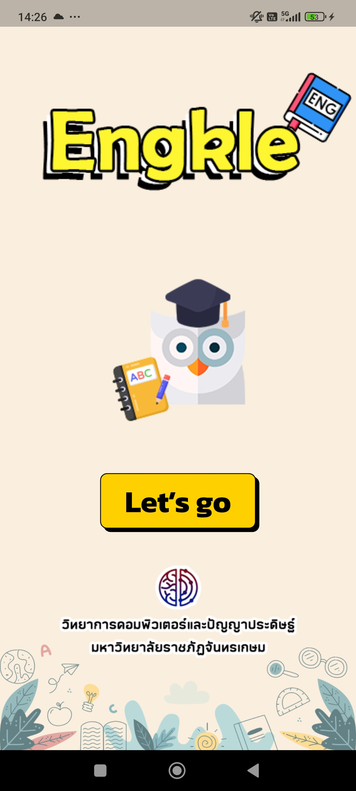

# 📱 Engkle - แอปพลิเคชันเรียนภาษาอังกฤษสำหรับเด็ก

## 🌟 ภาพรวมของแอปพลิเคชัน
Engkle เป็นแอปพลิเคชันที่ช่วยให้เด็ก ๆ สามารถเรียนรู้ภาษาอังกฤษผ่านเทคโนโลยี Text-to-Speech และ Speech-to-Text ได้อย่างสนุกสนาน

---

## 📸 รูปภาพของแอปพลิเคชัน

### 🔑 หน้าเข้าสู่ระบบ

### 🏡 หน้าแรกของแอปพลิเคชัน

### 👤 หน้าโปรไฟล์

### 📝 หน้าสมัครสมาชิก

### 🏫 หน้ารวมบทเรียน (ป.3)

### ✅ ตัวอย่างแบบฝึกหัด ป.3
| หน้าตอบคำถาม | ตอบถูก | ตอบผิด | ขอสิทธิ์บันทึกเสียง |
|---|---|---|---|
|  |  |  |  |

### 🏫 หน้ารวมบทเรียน (ป.6)

### ✅ ตัวอย่างแบบฝึกหัด ป.6
| ตอบถูก | ตอบผิด | ขอสิทธิ์บันทึกเสียง |
|---|---|---|
|  |  |  |

### 📊 หน้าคะแนน

### 🎨 หน้าเริ่มต้นของแอป

---

---

## 📌 เกี่ยวกับโครงการ
โครงการนี้พัฒนาขึ้นเพื่อการวิจัยที่สามารถช่วยให้เด็ก ๆ สามารถเรียนภาษาอังกฤษได้ง่ายขึ้นผ่านเทคโนโลยีที่ทันสมัย 🎓
